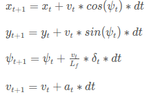
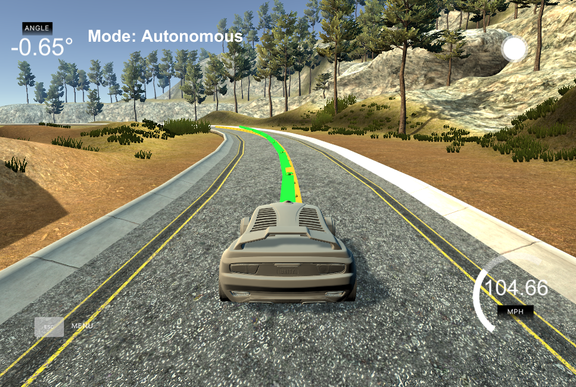
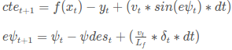

# UDACITY Self-Driving Car Nanodegree Program
## Model Predictive Control for Self Driving Cars

### Vehicle Model

To represent the vehicle motion, we use the [kinematic bicycle model](ieeexplore.ieee.org/document/7995816/) commonly used along with MPC for autonomous vehicles motion control. Such a model can be expressed as:



Where *x* and *y* represent the position of the vehicle in the reference frame. *v* the speed of the vehicle, *psi* the orientation, *delta* the steering angle, *a* is the acceleration, *Lf* is the distance from the front wheel to the center of gravity of the vehicle, and *dt* is the sampling time of the control system. The subscripts *t* and *t+1* denote the present and next value of the corresponding state, respectively. Note that the control inputs are *delta* and *a*, whereas *x*, *y*, *v*, *Psi* are the states of the vehicle.

### Timestep Length and Elapsed Duration (N & dt)

The prediction horizon of the model predictive controller is chosen as 1 sec with timestep length N set as 10 and elapse duration of 100 ms. These values were chosen as a trade-off between computational burden and controller accuray/stability. With these parameters the vehicle is able to safely complete a lap in the simulator at a maximum speed of 105 MPH as illustrated in the image below.



### Polynomial Fitting and MPC Preprocessing

Given that the location of the vehicle and waypoints are provided by the simulator in the world reference frame, we transform those points into the vehicle's local frame to facilitate the MPC timesteps computation and to enable the visualization of the reference path and trajectory of the vehicle in the simulator. Such a transformation is done as (main.cpp 114-129)
```C++
// Transform waypoints into vehicle's local frame
int num_waypoints = ptsx.size();
Eigen::VectorXd waypoints_x;
Eigen::VectorXd waypoints_y;
waypoints_x = Eigen::VectorXd(num_waypoints);
waypoints_y = Eigen::VectorXd(num_waypoints);

double cpsi = cos(psi);
double spsi = sin(psi);
for (int i = 0; i<num_waypoints; i++){
  double delta_x = ptsx[i] - px;
  double delta_y = ptsy[i] - py;
  waypoints_x[i] = delta_x * cpsi + delta_y * spsi;
  waypoints_y[i] = delta_x * -spsi + delta_y * cpsi;
}
```
With the MPC solver called as (main.cpp 138-141)
```C++
Eigen::VectorXd state(6);
state << 0, 0, 0, v, cte, epsi;

Solution mpc_sol = mpc.Solve(state, coeffs);
```
Having the waypoints in the vehicle's local frame, we then fit a third order polynomial to obtain our reference path. This reference path allows us to calculate the cross-track error (cte) and orientation error (epsi) as (main.cpp 134-136)
```C++
// Error calculation. In vehicle's local frame, px = 0
double cte = polyeval(coeffs, 0); 
double epsi = -atan(coeffs[1]);
```
Note that these errors are update in the MPC timestep calculations as follows (MPC.cpp 122-123)



#### Model Predictive Control with Latency

To cope with the command/actuation inherent latency of the system, the states of the vehicle are projected forward in time with a magnitude equals to the latency as indicated below (main.cpp 99-105)
```C++
// Project states 100ms forward in time
double delay = 0.1; 
double Lf = 2.67;
px += v*cos(psi)*delay;
py += v*sin(psi)*delay;
psi -= v*delta/Lf*delay;
v += a*delay;
```
Then, in the MPC timesteps calculation the control signal used is delayed one time step as (MPC.cpp 101-106) 
```C++
AD<double> a = vars[a_start + t - 1];
AD<double> delta = vars[delta_start + t - 1];
if (t > 1) {   // delay the command signal to account for latency
  a = vars[a_start + t - 2];
  delta = vars[delta_start + t - 2];
}
```
With these measures our controller is able to drive the vehicle safely around the track as can be seen in the following video.

[](http://www.youtube.com/watch?v=XEQdt3I5ll0)
